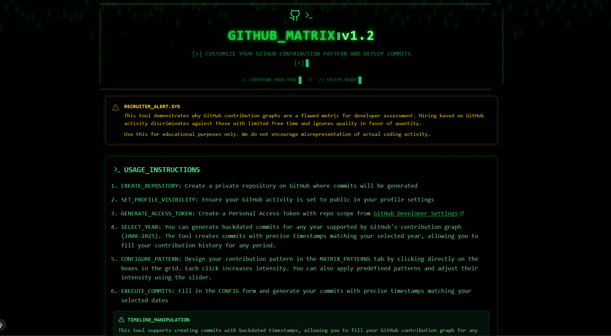

# GitHub Matrix

<div align="center">
  
  
  <p align="center">
    
    
    
    
  </p>
  
  <h3>Hack the GitHub contribution graph with style.</h3>
  
  <p>
    <a href="https://ghm.thesaurabh.tech/">Live Demo</a> •
    <a href="#-key-features">Key Features</a> •
    <a href="#-installation">Installation</a> •
    <a href="#-usage-guide">Usage Guide</a> •
    <a href="#-security">Security</a> •
    <a href="#-technical-details">Technical Details</a> •
    <a href="#-license">License</a> •
    <a href="#-contributing">Contributing</a>
  </p>
</div>

---

## 🖥️ Overview

**GitHub Matrix** is a cyberpunk-inspired tool that lets you design and generate custom GitHub contribution patterns. Create digital art, messages, or patterns directly on your GitHub profile's contribution graph using precise timestamp manipulation.

> _"I don't see code. All I see is blonde, brunette, redhead..."_

## ✨ Key Features

<table>
  <tr>
    <td width="50%">
      <h3>🎨 Interactive Design</h3>
      <ul>
        <li>Click cells to increase contribution intensity</li>
        <li>Real-time visual feedback</li>
        <li>Multiple intensity levels for depth</li>
      </ul>
    </td>
    <td width="50%">
      <h3>🔮 Year Selection</h3>
      <ul>
        <li>Design patterns for any year</li>
        <li>Fill in past contribution history</li>
        <li>Plan future contribution art</li>
      </ul>
    </td>
  </tr>
  <tr>
    <td width="50%">
      <h3>🏗️ Repository Control</h3>
      <ul>
        <li>Use any GitHub repository you own</li>
        <li>Control commit frequency and rate limits</li>
        <li>Custom commit messages</li>
      </ul>
    </td>
    <td width="50%">
      <h3>🔄 Export Options</h3>
      <ul>
        <li>Download your design as an image</li>
        <li>Generate real GitHub commits</li>
        <li>Share your patterns</li>
      </ul>
    </td>
  </tr>
  <tr>
    <td width="50%">
      <h3>🌐 100% Client-Side</h3>
      <ul>
        <li>All GitHub operations run in your browser</li>
        <li>No server timeouts for large patterns</li>
        <li>Real-time progress tracking</li>
      </ul>
    </td>
    <td width="50%">
      <h3>⏱️ Resumable Operations</h3>
      <ul>
        <li>Auto-save progress for large jobs</li>
        <li>Resume interrupted operations</li>
        <li>Detailed time estimates</li>
      </ul>
    </td>
  </tr>
</table>

## 🚀 Installation

```bash
# Clone the repository
git clone https://github.com/thesupersaurabh/github-matrix.git

# Navigate to the project directory
cd github-matrix

# Install dependencies
npm install
# or
pnpm install

# Start the development server
npm run dev
# or
pnpm dev
```

Then open **[http://localhost:3000](http://localhost:3000)** in your browser to see the matrix.

## 📖 Usage Guide

### Creating Your Contribution Pattern

1. **Design Your Pattern**
   - Click on cells in the contribution grid to increase intensity
   - Use the year selector to navigate between different years
   - Reset button clears your current design

2. **Configure GitHub Access**
   - Create a fine-grained GitHub Personal Access Token:
     - Go to: GitHub → Settings → Developer settings → Personal access tokens → Fine-grained tokens
     - Grant "Contents" (Read and write) permission to your target repository
   - Configure your username and repository details

3. **Generate Commits**
   - Set your desired commit frequency (commits per minute)
   - Choose between creating real commits or exporting as an image
   - Watch the real-time progress as commits are generated in your browser
   - For large patterns, you can safely leave the tab open - the process will continue

### Recommended Settings

```
Repository: a dedicated empty repository
Commit Rate: 60-100 per minute (to avoid API rate limits)
Token Scope: Fine-grained with minimal permissions
Browser: Keep the tab open for large operations
```

## 🛡️ Security

GitHub Matrix is designed with security as a priority:

- **100% client-side**: All GitHub operations run entirely in your browser 
- **No server calls**: Commit generation happens directly from browser to GitHub API
- **Resumable operations**: Progress is saved locally for large patterns
- **No server storage**: Your GitHub token is never sent to any server
- **Minimal permissions**: Uses fine-grained tokens with limited scope
- **Zero analytics**: No tracking or data collection

Your GitHub credentials and tokens remain on your device and are only used for direct GitHub API calls.

## 💡 Technical Details

- **Client-side architecture**: Eliminates server timeouts by moving all GitHub API calls to the browser
- **Rate limiting**: Smart rate limiting to avoid GitHub API restrictions
- **Progress tracking**: Real-time updates on commit generation progress
- **Efficient batching**: Processes commits in optimized batches
- **localStorage integration**: Saves progress for resuming large operations
- **Detailed metrics**: Shows elapsed time, remaining time, and commit rates

## 📃 License

Released under the MIT License. See [LICENSE](https://github.com/thesupersaurabh/github-matrix/blob/main/LICENSE) for details.

## 🤝 Contributing

Contributions are welcome! Please feel free to submit a Pull Request.

---

<div align="center">
  <p>Made with ⚡ by <a href="https://github.com/thesupersaurabh">Saurabh Kumar Thakur</a></p>
  <p>
    <a href="https://github.com/thesupersaurabh">
      
    </a>
    <a href="https://twitter.com/thesupersaurabh">
      
    </a>
    <a href="https://linkedin.com/in/thesupersaurabh">
      
    </a>
    <a href="https://thesaurabh.tech">
      
    </a>
  </p>
</div> 
